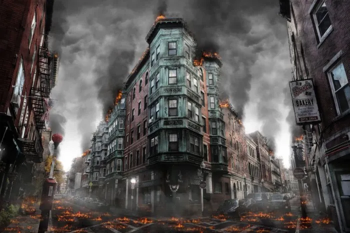

  
**We shine to finally dissolve into oblivion and be absolved through death**

***God clutches a razor blade.*** *Activity* in every sense of the word constitutes the primordial chain that binds us together — that enslaves ourselves to each other. When one is born, they are simply *thrown* into existence — nobody quite asks to be here. What is required of us in the face of such debasing and demeaning circumstances? Very little. People are not materials for culture, mere tools for their resident society. We are transcendental subjects of experience shaped by psychoplatonically ingrained value matrices — we are meaning-seeking and meaning-creating creatures. One among very few unitary properties amidst the wonderful chaos of our scattered human natures, but we respond to this need through endless repetitions of incommensurable differences. Full spiritual alignment with ‘your’ culture as such is possible for many, but certainly not everybody. *This* skeptical mystic finds nothing redemptive in the civilizational icons we have designed. My ‘evil eye’ sees only hypocrisy, barbaric pseudo-moral values, pathetic social posturing, violence, brutality, and vicious cycles of revenge; a society-first lexicon: this is even inherent in many expressions of radically individualist philosophies! Where has the transcendental subject faded from our view — did we ever truly recognize it? You have painted our souls red with the blood borne from your ambitions, your vain pretense, but any power obtained in the process paves the road to nothingness. All that you would butcher-to-build will fade away, crumble into ashes and dust, history in the long-run inevitably bleeds out your poison. Only in this sense does there exist karmic justice in the world. Entropy eventually corrects sentientkind in accordance to the moral law.

***An event of nihilism.*** The encounter with your personal sense of nihilism — setting aside rigid, precise, and cognitively autistic static currents of thought: i.e. ‘definitions’ — is very important for your spiritual development. Through such a process people either find themselves, or find themselves lacking. Each case reveals the *supra*-hylomorphic soul to the transcendental subject via an important question: *what do you lack in this lifetime?* This question, when seriously considered, either breaks or creates a person. What values have you made truly your own? It is important to be able to name at least *one* thing. Our capacity to individuate in such a manner is what cleanly separates the human subject from our otherwise close animal cousins. Yet all we see in the world, not just in the world ‘today’, but in the world *always*, is a profound lack of attentiveness to what one’s value matrix demands — what is coherent and incoherent about its internal content. Reflexive judgments are all-too-often made, our emotionally charged sparks of error. Quick to judge, quick to anger, and slow to understand. Not to address meta-ethical nihilism, nor even attitudes that disregard all concerns for morality simpliciter, but to express that *cultural* nihilism is the dominant paradigm to combat. Our theologians, our naturalists, and all other sublimated expressions of *priesthood* have lead us to obscure the moral law. Not qua Kantian conceptions — certainly not *any* procedural ‘realist’ subterfuge. A much more substantive concept of the moral law is required to respect the character of moral discourse, to respect ourselves by extension. A modern statement of moral platonism: Moral facts as states of affairs that necessarily obtain; moral judgments as *overriding* for they calculate all other concerns in order to produce your ‘ought’. Questions like “why be moral?” are as coherent as “why be rational?” The appropriate restatement: “Why should I do what I ought to do?” *Simply listen to yourselves*.

***Methodological cutting knives.*** Words are infinitely-dimensional french necklaces. Symbols to manipulate toward any purpose, in any curved direction of our geometrically hyperbolic and infinite conceptual space. The creative nothing; the creative vacuum of nothing: the human-being-of-becoming. Those who insist on linear thought patterns, ‘first principles’, and settled definitions skip the creativity and fun embedded in excited cognition — which has more *purpose* than just *creativity* and *fun*. We need such heightened emotional stimuli, a continuous entrainment of our interpretive abilities, otherwise we can never truly understand each other: only otherwise by proxy descriptions that seem clear because they are disconnected from the process of deliberation — from the true voice of the speaker.

***Orbiting around poles of raw negativity.*** We float in a directionless void defined only by relationships of difference — as cosmic puppets with no puppeteer, with zero strings attached. The black star that one confronts upon deep meditation; Nietzsche’s gazing abyss; the white contrast reflected in our eyes. To merely desire direct communion with being itself, the ineffable strata lusted after in all spiritual quests, is to truly ‘know thyself.’ Can you see the light beyond?

***The downstream of the sun.*** Science is our developed existential quest to look into the eye of eternity, the singularity that shaped the entirety of our existence. All intellectual rivers lead to some variety of cosmogony: systematic and intertwined, the primary expression that is ‘monism’ rests on our lips — but hidden throughout dynamic proxy arrays of misleading symbols. To conceive of the scientific worldview as one that should eliminate, reduce, or outright *ignore* what was written on the human spirit long ago calls into question the purpose of our inquiries in the first place. What are we doing with our will-to-truth, exactly? Reality is not so distinct from ourselves, there is no visible wall separating the cosmic eye from the mind’s eye. Not to submit to humility and fear truth claims, not to debase ourselves by warping methodological skepticism into our own self-parody, but to gain awareness that facts have *curvature* — that perspective doesn’t distort but helpfully clothes and otherwise textures the bare substrate of a silent reality.

*I disconnect all patterns  
Disintegrate my blood and bones  
Then analyze consequences  
My body is weak in narcosis now refined  
Clarity and suffering thus collide  
Deconstruction of reality should help me to  
Understand this violent decay  
Electric neurodrive to induce self-demise  
Could I become God if I bleed enough?*  
(***S***. ***Antares***: *Neurodrive*)
