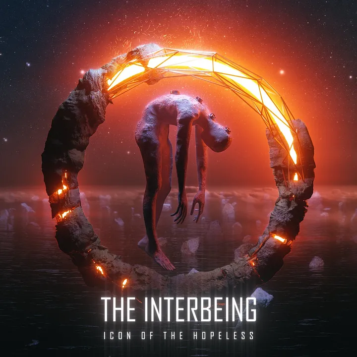

**“Defy and disavow the divine design.”**

I have long respected The Interbeing for slithering in a subliminal space between obscurity and the limelight. The Danish ensemble have quietly and stubbornly endured, cementing themselves in the djent metal scene against all cultural trends and market dynamism. They represent the independence made possible when artists have backup careers they can utilise to finance their pursuits: it doesn’t matter if your music is only catching a few eyes, you can simply drop one album every half decade — without a care in the world.

A naive take would be to dismiss this crew as generic: simple products of New Millennium sonic trends and nothing more. That would be deeply mistaken; a crime to your own artistic life. Here lies a borderline fetishistic addiction to polymeters and bouyant guitar patterns, but so too do we find melodically unique death metal vocals, strong lyricism, and 20-dimensional instrument and FX layering that keeps the waveform — and your ears — busy analysing it all.

Conceptual storytelling through the method of abstract and celestial motifs provide the foundation of every album released by The Interbeing. Every album linearly builds on the narrative explored in the previous entry. As entitled, we follow the horrific journeys of ‘the interbeing,’ a kind of shapeless form of existence that shifts between dimensions — without a stable identity; lacking corporeal consistency.

Where ‘Edge of the Obscure’ was a tale immanent to the being itself — what it would be like to journey across spatial terrains in such a confused state — leading to his apparent oblivion, ‘Among the Amorphous’ told a strong tale of rebellion and independence. Rising up against the deified, mechanical creators that reign over a defiled cosmos — treating the universe as a kind of pseudo-magical laboratory experiment — our protagonist fused with the heart of his malicious creators. The resulting paradoxical tension created a dangerous fragmentation and spurred forth cosmic revolution. Now that these false gods have been debased and our protagonist has tasted their syncretic energies, he thus emerges as an anti-deity: An ‘Icon of the Hopeless,’ bringing hope through desacralisation and destruction — christened with the symbolism of a black halo. This album explores the consequences and thematic implications of this dramatic rearrangement of Alpha and Omega, singing a spiritual hymn about the relationship between authoritarianism and religion.

The lyrics are captivating and distinguished in presentation: a hidden benefit, I have long speculated, of poets writing in English as their secondary or tertiary language. This band achieves a palatable poetic style that is hard to do well: using an abundance of uncommon words and synonyms, without much attention to explicit rhyme and flow. Most artists stumble over themselves in their frenetic quest for purple prose, as if they had plagiarized the early draft copy of a Victorian novel. While it is arguable that this strong lyrical focus atrophied after their first album, ‘The Edge of the Obscure’ — now leaning into a clear, descriptive style focused on unfolding story events — The Interbeing still has a knack for wordsmithing exactly the right line that mystically resonates with your higher senses. “Fade the sunlight and dissipate, I pray for no-one.”

Hauntingly beautiful choruses permeate this release. Here is where the audio production and melodic writing really shines through: there is a distinguished sense where every single multiline track is synthesised into singular harmony — all while maintaining an atmospheric and 3-dimensional soundscape. Each layer stands apart, yet is blended together in a synaesthetic fashion. As a result, tracks like ‘Perplexion’ bring forth psychedelic flashbacks in wondrous frenzy.

While this incredible feat of contemporary audio engineering is making itself known, in classically-contemporary fashion we have multiple guitars chugging, grinding, and bouncing away in timely asynchronicity with each other. There is a reflexive disharmony in play: where the instrumental work simultaneously demands extreme focus, yet can lull you into ego dissolution as the frenetic pace takes over your realm of experience. Synthetic effects are alternatively pulsating a knife through the sound wave, or otherwise coating the atmosphere already built up by blasting drums and dithyrambic discord. With the advent of ‘Among the Amorphous,’ the vocalist evolved their mid-range focused screams into a soft and highly melodic false cord. A stylistic change that is the definition of ‘an acquired taste,’ but in this new album these tonally immersive properties are exploited to their full potential. The vocals are one with the track; one with all that is above the divine.

The soul of this ‘metal opera’ piece is cerebral and well-thought-out: in a world absent tyrannised meaning, the purpose immanent to nature and our hearts is waiting to be discovered — there is, after all, value-creation in destruction and sacrilege. For those who would disavow extrinsic designs imposed on them by grand sociological orders, there is an existentially liberating frenzy felt when fate is overcome. Songs like ‘Ruin’ and ‘Eternal Eclipse’ hammer this point home. As Bakunin put it, “the passion for destruction is a creative passion.”

One only hopes that this isn’t the last album we hear from The Interbeing. Their release cycles are already unpredictable and stretched out; it is a stark reminder that they have lives beyond their craft. This album crowns such a thematic completeness on the developed story; bringing with it the anxious anticipation that this ensemble could abandon the project at any time, while still feeling satisfied. If that is their fate, then so be it, but as a loyal listener who has been paying close attention ever since their 2008 EP ‘Perceptual Confusion’ dropped, I am always hungry for more. Icon of the Hopeless delivers the third act of a memorable and tonally overwhelming journey that begs for an extended novelisation — anything that could extend this dark mysticism into as many formats as there are dimensions to this work of art.
