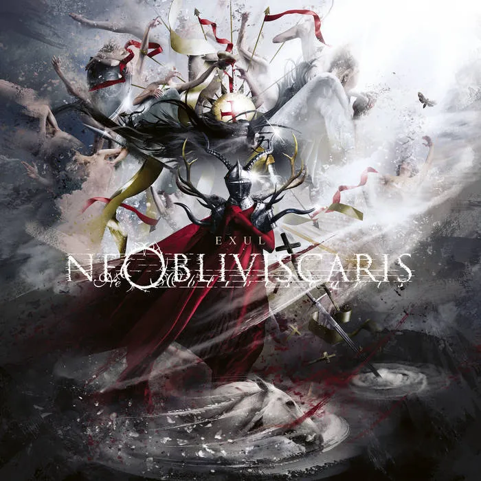

  
“Resonance of petrichor weaves black noise.”

Australia suffers no lack of exported musical talent. Ne Obliviscaris are relatively well-known in the metal scene for their neon river of influences and complicated arrangements that transcend archetypal progressive metal: shaping ‘randomised chaos’ into ‘thoughtfully composed mood pieces still displaying new textures every second.’ There is no weakness or strength inherent to either approach. If Between the Buried and Me should represent compositional chaos, Ne Obliviscaris would champion solidified order.

The Australian ensemble has fought tooth and nail to stay alive. Swimming against the current as high-fidelity underdogs, armed with writing that is incredibly intricate and audio production values that are always beyond criticism — benefiting heavily from our era of low-cost music production — they seemed all but destined to fade into disarray upon publishing their first album, ‘Portal of I.’ While it is an excellent album that was received well — back then I would describe the band as ‘post black metal,’ a phrase I would shy away from now: for their art has grown into indefinable mesmerism — it seemed like an unfortunate spark of divine light, an endeavour too inaccessible and logistically overburdened to carry them throughout the years. They would, however, quickly prove that false with their massively successful Patreon campaign launched in 2016: Allowing Ne Obliviscaris to reserve capital as net profit rather than merely struggling to keep themselves afloat. Receiving a massive cacophony of criticism over this decision, their violinist and clean vocalist — Tim Charles — didn’t shy away and quite eloquently rebuked all criticism. The approach speaks for itself: as of 2023, their Patreon campaign is not only an extremely reasonable way to support a favoured artist, but thrives as a beating pulse keeping the band alive.

Ne Obliviscaris are the crystallisation of egalitarian opportunities made possible by economic globalism and high-velocity informational dissemination. Our digital era is, in a statement that shouldn’t be controversial, bringing about a golden age of music. Artists that would face short-lived careers or an audience that lived too far away now have the tools to produce, distribute, and monetise their content with ever-more variety. There was never a steady distinction between ‘artist’ and ‘entrepreneur’: its instability is only becoming more evident. While old-guard artists from the mid-20th century are addicted to intellectual property royalties, thousands of artists are blooming despite the apparent ‘threats’ of piracy and shady market schemes of the music industry. People are always quick to predict doom and gloom when our civilisation moves through technological paradigms.

For those passionate about music, we have witnessed nothing but an explosion of accessible creativity. Every artist unlikely to eternally survive on ‘One Hit Wonders,’ those truly dedicated to their craft — who expect the best from themselves — are rewarded by their enthusiasm very much valued in the consumer marketplace. Even our pop music charts are far more eclectic and varied in inspiration than ever before. (Ex: Falling in Reverse released ‘Watch the World Burn’ in January 2023, a chorusless song that alternates between many styles of rap, punk, ‘the Alice Cooper interlude,’ and capping it off with modern-day metal — plus true kvlt black metal screams in its final moments. It quickly trended at #4 on YouTube Music.)

With the release of ‘Citadel’ circa 2014, Ne Obliviscaris shifted toward atmospheric and emotional scenery over arbitrary complexity. That is not to say the arrangement is now simple — few can compress more stylistic influences and textured transitions into a singular waveform than Ne Obliviscaris — but resonating with classical music pieces dedicated to communicating unspoken lyrical themes, Ne Obliviscaris has carried this torch onward to ‘Urn’ and now ‘Exul.’ Every song produced is in keeping with their leitmotif: ‘Forget Not.’

This album starts off strong with ‘Equus,’ textually dedicated to the wildfires that raged around the radius of Melbourne, Australia one decade past — harming much animal life with it. We are always called to remember something, be it specific historical events or imprints of the blackest emotions. Ne Obliviscaris is relentless yet tastefully gentle with this overarching theme. Xenoyr’s growls are incredibly thick, powerful, and refined: they echo into the sonic expanse of every pulse with uttermost splendour and presence. It is really a treat to hear his talent develop over the years. Tim Charles’ bittersweet violins are as welcome as ever, introducing themselves as crunching and aggressive or silky and pacified at precisely the right moment. Dan Pressland’s percussive alchemy would embarrass even Zhuangzi with how it blasts beyond perception, sensation, motion, and skill.

Ne Obliviscaris creates music that uplifts one’s soul into higher dimensions of being, should one give their full and undivided attention to it. There is always so much detail punching through dimension and time, it is difficult to ‘remember’ the contents of a track: how appropriate that this is the one area where the audience is not expected to fulfil their self-titled motif. ‘Misericorde II’ is thus a surprising track birthed from this album: it focuses on a kind of calculated repetition not seen since ‘As Icicles Fall,’ but this time more refined than ever. It reminds one of Thy Catafalque: music that can become dynamic or continuous at will, but always infinitely layered with new surprises waiting to jump out at you upon revisiting their material. ‘Misericorde I’ and ‘Susypyre’ impress impossible tonal variety, overflowing you with one expertly crafted wave of sound. It seems that the band only gets better and better at understanding what they want to do, and nothing is standing in their way.

Ne Obliviscaris have — at worst — lived up to their reputation with ‘Exul.’ What a delightful consistency to mark in one’s catalogue! We should all be overjoyed to witness the continuous improvement of a formula that seemingly achieved its apex with ‘Urn.’ Our closing track, Anhedonia, is a considerate way to cap off the album. Having gone through the motions of eternity and witnessing its indescribable pattern, we receive a spiritual lament, a way to ground ourselves in reality: which recalls the lyrical undercurrents already present in each track. Yes, the music is beautiful, but its catalysts and causes are forged from oppositional suffering and diminution.

I cannot regard ‘Exul’ as anything but a near-perfect album: there is simply nothing to criticise. All such attempts would feel like empty contrarianism. Giving Ne Obliviscaris their due, one can only report joyously that their sustained endeavour stands proud and stakes its right to existence.
