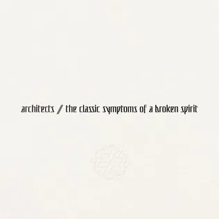

A flurry of musicians are releasing new material in quick succession. Fuelled by productive isolation born from the early COVID lockdown era, many artists are anxious to organise and market their creative backlog developed in that perilous and uncertain time period. I was surprised to see *The Classic Symptoms Of A Broken Spirit* published one year following the controversial but critically well-received *For Those That Wish To Exist*; I was equally worried that this constituted evidence of a rushed release. Fortunately, my fears were misplaced. Architects have dropped a fun, energetic, and catchy summation of their discography.

Proudly wearing their influences upon their sleeves, *The Classic Symptoms Of A Broken Spirit* rings a percussive electroshock reminiscent of contemporary pop, beautifully woven within alternating metalcore and djent tonal patterns. While the orchestral nature of *For Those That Wish To Exist* takes a decisive backseat on this album, Architects have not sacrificed substance to cement their new sound. There are tastefully arranged string reveries whenever they feel required: the curveball-track *Burn Down My House* is just such an example. Whereas the organic nature of *Lost Forever // Lost Together* was a noticeable signature that carried itself all the way into *Holy Hell*, the FX production on this album is unabashedly synthetic and artificial. It lavishes in the aeon of accessible digital audio production, sparing no opportunity to layer near-incalculable filters on a moment-to-moment basis. Although it is evident that various tracks on this album are made for the concert arena, such as the wide chorus of *When We Were Young*, this record is really meant to be appreciated as a studio production first and foremost. This will be lambasted by certain purists who reduce this artistic process to ‘autotune,’ but those unfortunate voices are destined for impotent irrelevance.

This brings me to the point of boiling tension within the old-guard Architects fanbase, who feel left behind by their latest excursions. Gone are the structural writing complexities found in albums like *All Our Gods Have Abandoned Us*. While there is lingering evidence of a desire to play with structure, from *Holy Hell* onwards one fact cannot be avoided: the band has prioritised catchy hooks and chunky riffs over songwriting exposé. *Ipso facto*, this isn’t a bad thing. So long as Architects can deliver on the promise of their new purpose, to carry the whiplash energy of their earlier music into the synthesis of metalcore, djent, EDM, and pop achieved by contemporaries like *Bring Me The Horizon*, they can maintain their reputation as a band worth loving. The nervous anticipation surrounding this album asks the question: “Can they deliver on this promise?” — The industrial grind and dancing kinetics of *All The Love In The World* answers in the affirmative. It responds with its own lyrical question: “Have we nothing left to sing about now? Do I really wanna shout about all the love in the world?”

Taking up the torch of lyricism from the late Tom Searle, the band’s drummer Dan Searle continues his laudable foray into explicating the long-established cynical themes of Architects. While this album is not below producing rhymes for their own sake, it is far from the lazy, mindless drivel that is all-too-common in the last hundred-plus years of music. The record title really speaks for itself here. We receive an explanation of 2021’s *For Those That Wish to Exist* through tracks like *Living Is Killing Us* and *Deep Fake*. In a world where “these tyrants will build an abyss, but the rest of us wish to exist,” to endure through the decay of modernity is an act of existential defiance and meaning-creation. The symphonies produced by a broken spirit may feel, at times, like “a wasted hymn,” but with this concentration of righteous anger and authentic expression, we find within reach the pulsating apex of life that authoritarian structures around the world would deny us. This, I believe, is the essence of Architects as a political and otherwise spiritually focused band. Architects does not deliver on-the-nose motivational speeches in order to affirm the value of existence. Revelling in bitterness and lampshading the impoverished social conditions which foster a sense of collective plight — our unifying need for pessimistic music — is all the inspiration that fellow-travellers of this message require.

Amidst the hauntingly memorable exploration into the industrialised human condition, Sam Carter stokes the fires of anger and angst with his windswept vocal range characterised by refined grit, demonic brutality, and angelic melancholy. Every word is brought to life through his matured dedication to teasing out our heart’s quiet thunder. His natural talent is only enhanced with incredibly clever and intricate vocal programming that stands as a testament to the achievements of contemporary audio engineering. There would be no recognisable trace of Architects without Carter’s soul-shattering but spirit-mending presence, which takes new and surprising forms at every rhythmical progression.

A spirit of uncompromising independence permeates this album: tracks like the anthem-marching *Doomscrolling* state this fact quite forcefully. Almost as if in answer to their harshest critics, the dizzying *Be Very Afraid* is featured as the closing finale. It is an absolute monster of a track that immediately stands out as among the best in their catalogue. The structure is chaotic; the tone is excessively downtuned; all while glitch-y, electronic waves ride along the frenzied wall of sound — a high-pitched ebb and flow that, quite strangely and delightfully, imports the popular EDM signature more strongly than anything Architects have heretofore produced. This contrast between dark, foreboding quasi-technical heaviness in defiance of their usual verse-chorus repetition on one hand, and a synthetic fabric of buoyant electro-patterns that would define *Bring Me The Horizon’s* ‘Amo’ on the other, all constitutes such a perfect mission statement. It gives their core fans what they desire whilst refusing to deliver the full package of purely analog instrumentalism. This two-tiered approach toward upholding their continuous identity, which in the same breath says farewell to their earliest pseudo-mathcore aspirations, exemplifies the shining ethos of the last two album cycles.

*The Classic Symptoms Of A Broken Spirit* has proven that Architects are still flourishing in their prime. I was initially disheartened by the repetitious and monotonous meta-structure found in their so-far released singles, but even the generic songs on this album belong as part of a coherent whole. This album is more than the sum of its parts; you would be doing yourself a disservice to ignore the front-to-back listening order. For those that see Architects as a kind of spiritual companion, their segue into the 21st century apocalypse, this journey is not diminished by a few concessions to relative structural simplicity which wastes no time in driving home the punch of doomsaying and armageddon.
